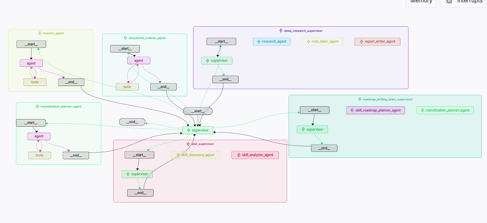
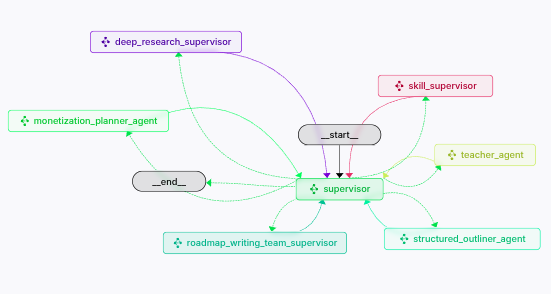

# 

# 

# 🧠 Skill-to-Income Multi-Agent System

This repository contains a fully modular **multi-agent system** built with **LangGraph**, designed to automate the journey from **skill discovery** to **learning roadmap** to **income generation**. The system is orchestrated via a top-level supervisor that delegates tasks to specialized agents or agent teams, all powered by OpenAI models, Tavily Search, and local file tools.

---

## 🚀 What It Does

- **Identifies high-potential skills**
- **Analyzes feasibility, learning curve, competition**
- **Generates 30–60 day learning plans**
- **Builds structured 3–6 month roadmaps**
- **Produces monetization strategies (freelancing, content, product)**
- **Handles research, visualization, and structured documentation**

All outputs are markdown or JSON-based, ready to be displayed or exported.

---

## 🧩 Agent Architecture Overview

| Component                    | Purpose                                                                 |
|-----------------------------|-------------------------------------------------------------------------|
| `skill_supervisor`          | Manages skill discovery and learning plan generation                   |
| `teacher_agent`             | Provides verified learning resources and answers                       |
| `general_doc_writer_team`   | Generates outlines, edits markdown/JSON, and produces charts           |
| `roadmap_writing_team`      | Builds long-term skill roadmap + monetization strategies               |
| `deep_research_supervisor`  | Executes deep topic research and summarization                         |
| `system_supervisor`         | Central orchestrator for all tasks                                     |

> Agents use Tavily, Markdown/JSON I/O, Python charting, and file parsing tools behind the scenes.

---

## 🛠️ Tools Integrated

- `TavilySearch` – Web search for skills, resources, monetization
- `write_md_document`, `read_md_document`, `edit_md_document` – Markdown I/O
- `write_json_document`, `read_json_document` – Structured data handling
- `python_repl_tool` – Dynamic chart generation
- `parse_progress_data` – Parses user-uploaded skill progress data

---

## 🖥️ Tech Stack

- **LangGraph** (multi-agent orchestration)
- **LangChain** (LLM abstraction)
- **OpenAI GPT-4.1-mini** (core LLM)
- **Tavily API** (real-time research)
- **Streamlit UI** (frontend integration)
- **File-backed memory & storage** for deterministic context

---

## 📁 Output Directory Structure

All generated content is saved under:
```bash
~/Aditya/y_projects/mc/outputs/


🧪 Usage
Import and call the system_supervisor in your Streamlit or CLI interface. Provide user context or a file, and the system will autonomously:

Discover skills

Plan learning paths

Write documents

Visualize content

Suggest monetization strategies

All in one flow.

📌 Notes
All agents report only final outputs.

Intermediate steps, prompts, or agent logic are fully abstracted.

System is designed for scalability, modularity, and end-to-end automation.

🧑‍💻 Author
Adi — MSc. Data Science @ TU Braunschweig
Building monetizable tools using agentic AI systems.

